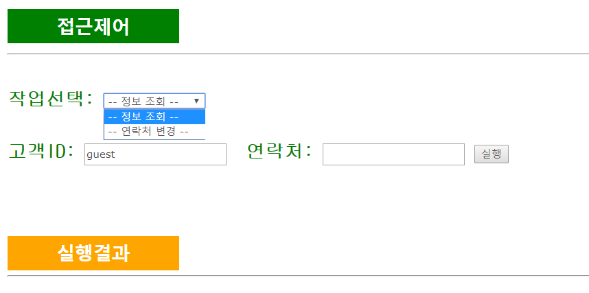
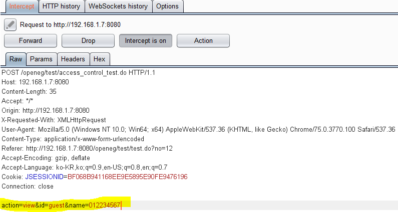
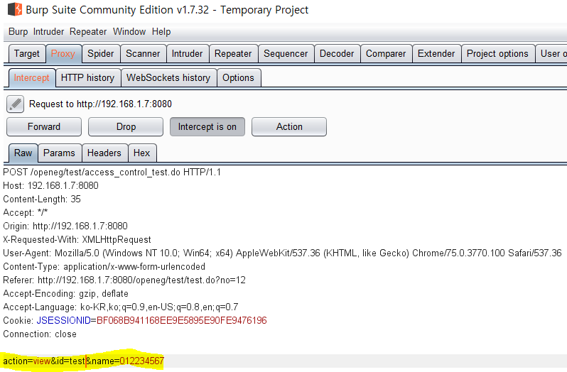
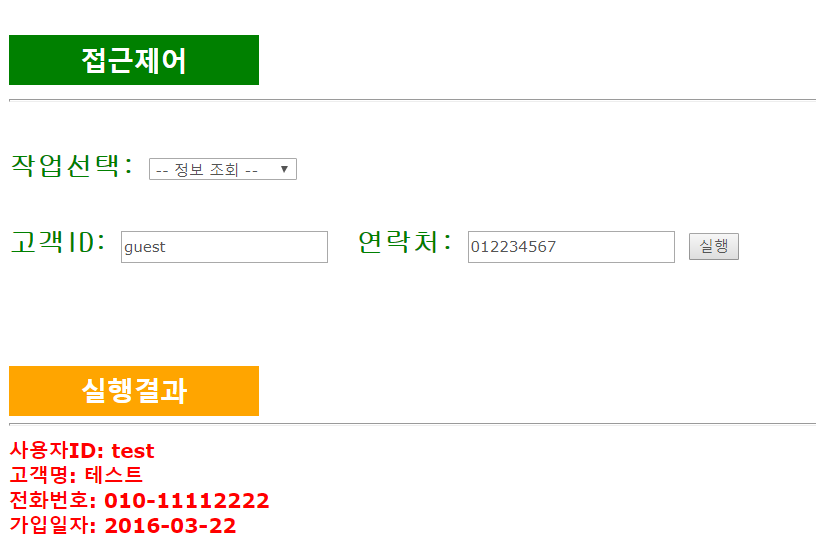
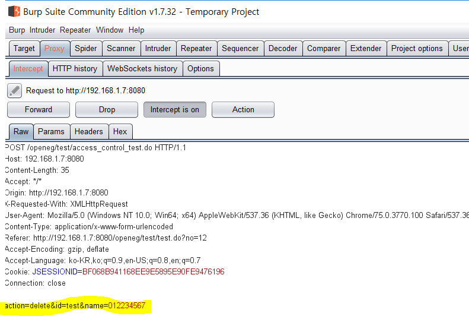
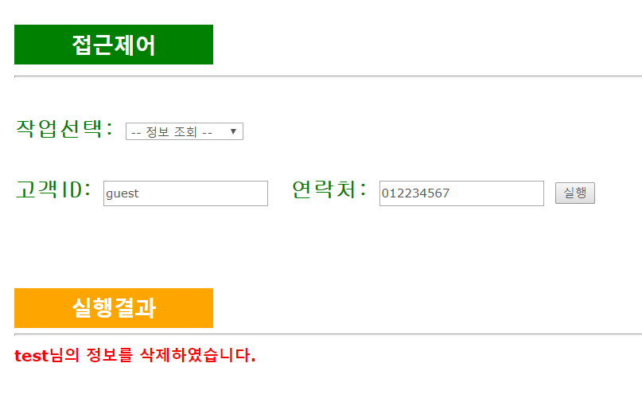

# 파라미터 조작과 잘못된 접근제어

## 잘못된 접근제어
인증을 통해 시스템에 접근한 공격자는 URL이나 파라미터를 조작해 권한이 필요한 기능에 접근할 수 있게 되는데, 이 경우 인가된 사용자에 대한 권한이 제대로 체크되지 않았으므로 허락되지 않은 기능을 수행하는 것이 가능하다.

 

## 원인
- 비 인가된 기능에 대해 UI가 제공되는 경우
- 특정 기능에 대해 적절한 인증과 인가 작업이 수행되지 않는 경우
- 공격자가 제공한 정보에 대한 점검작업이 서버 상에서 수행되지 않는 경우

 

## 취약점 진단
1. URL 조작을 통한 리소스 접근 진단
   - 접근을 허용하지 않는 페이지를 단순히 UI를 통해 들어갈 수 있는 방법만 차단했을 경우, 공격자는 웹 UI를 거치지 않고 바로 URL를 조작하여 인가되지 않은 페이지로 접근을 시도할 수 있다.
2. 파라미터 조작을 통한 접근 진단
   - action 파라미터를 사용하여 요청을 구분하는 경우, 사용자 별로 요청 가능한 action의 접근 권한 체크가 이루어져야 한다.
3. 잘못된 권한 체크로 인한 기능 수행 진단
   - 데이터 수정 등을 위해 데이터의 id 정보를 hidden form으로 제공했을 경우, paros와 같은 툴을 이용하여 로그인한 사용자가 본인이 작성한 글이 아닌 다른 사용자의 글 번호를 적고 저장하면, 서버 단에서 로그인한 사용자와 수정된 글의 번호를 작성한 사용자가 같은지 비교하지 않으면 보안 이슈가 발생한다.

 

## 방어법
- 권한 부여를 관리하는 프로세스를 고려하고 업데이트 및 감사 등이 쉽게 될 수 있도록 구성한다.
- 접근 통제 원칙을 고려하여 접근 권한을 부여한다. 여기서는 특히 최소권한의 원칙에 대해 고려하는 것이 좋아보인다.
   - 알 필요성 원칙: 해당 업무에 대해서만 접근 권한을 부여한다.
   - 최소권한의 원칙: 업무수행에 필요한 최소한의 권한만 부여한다.
   - 직무분리 원칙: 특정인에게 모든 업무 권한을 부여하지 않는다.
- 워크플로우를 분석해 올바른 흐름으로 구성되었는지 검토한다.
- 숨겨진 내부의 기능을 검증하기 위해서는 컨트롤러 및 비즈니스 로직 단계에서도 함께 보안적인 부분을 검토해야 한다.

 

## 실습
접근 제어에 관한 실습이다. 이 페이지는 관리자가 아니면 자신의 정보 조회를 확인한 후 연락처를 변경할 수 있다. 실습할 때 guest라는 계정으로 들어갔기 때문에 조회와 수정 외 다른 동작은 할 수 없도록 seletor가 설정되어 있는 것을 확인할 수 있다.

프록시 툴을 이용해서 조회 시 어떤 정보가 가는지 확인해보았다. `action` 파라미터를 통해 조회나 수정 등의 작업을 할 수 있고, `id` 파라미터로 action의 대상을 지정한다.

삭제하기 전에 일단 정보 조회부터 해야 한다. id만 test로 변경하여 서버에 조작된 요청을 보내보자.

test 유저의 계정 정보가 출력된 것을 확인할 수 있다.

이제 이 계정을 삭제해보자. action 파라미터의 값을 delete로 수정한다.

test 계정이 삭제된 것을 확인할 수 있다.

 

## 참고
- <https://cocomo.tistory.com/302?category=681263>
- <https://blog.naver.com/rockcrash/220478882223>
