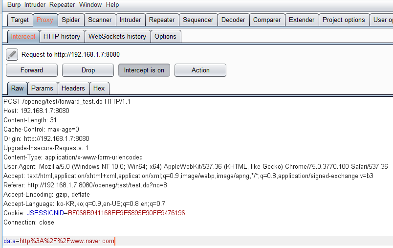
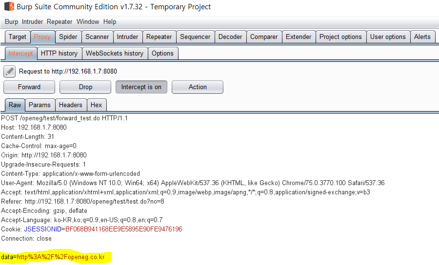
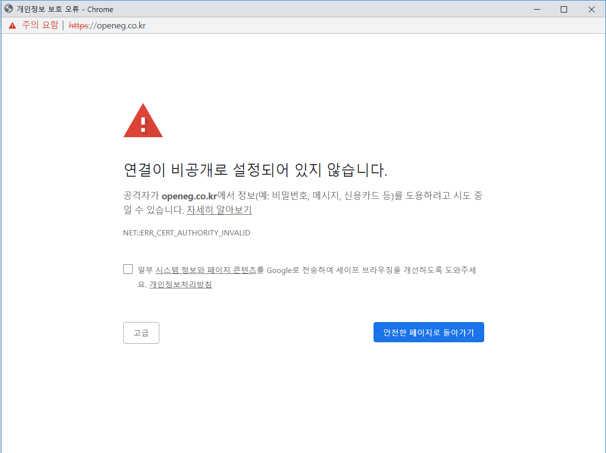

# 안전하지 않은 리다이렉트와 포워드
## 요약


웹 애플리케이션이 사용자가 입력한 값을 이용해 접속한 사용자를 다른 페이지로 분기시키는 기능을 가지고 있는 경우, 이동되는 목적지에 대한 검증이 제대로 이뤄지지 않는다면 피싱 사이트나 악성코드를 배포하는 사이트 등으로 사용자정보를 넘겨 접속하거나 인가되지 않은 페이지로 접근하는 등의 문제가 발생할 수 있다.

공격자는 정상적인 사이트에 접속하는 것처럼 속여 다른 악의적인 사이트로 분기시키거나, 검증되지 않은 사이트 링크를 사용자가 클릭하도록 만들어서 안전하지 못한 사이트로의 접속을 유도한다.

URL 정보를 세팅할 수 있는 부분을 살펴보는 방법으로 취약점은 쉽게 확인할 수 있지만, 내부적으로 일어나는 분기인 forward 페이지들은 검색하기 쉽지 않다. 이 취약점으로 인해 악성코드를 설치하거나 중요 정보를 노출시키도록 속여 접근통제를 우회할 수 있으므로 주의해야 한다.

<br>

## 취약점 진단
- 리다이렉트에 외부 입력값을 URL로 사용하는가?
   - 오픈 리다이렉트
   - 로컬 프록시를 이용하여 외부 입력값을 조작하여 악성 사이트에 리다이렉트 되도록 할 수 있다.
   - 리다이렉트에 사용되는 URL은 소스 코드에 하드코딩하도록 수정한다. 즉, 외부 입력값을 이용한 리다이렉트나 포워드 기능을 사용하지 않는 것을 권장한다.
   - 외부 입력값을 사용하여 이동해야 하는 경우, 이동 가능한 페이지들을 소스코드에 목록화하고, 외부 입력값은 목록화된 정보 중 필요한 정보를 선택하여 사용할 수 있는 인덱스값으로 구현한다.
- 응답코드 302 체크
   - Paros의 기능 중 사이트 정보를 수집하는 툴 메뉴를 이용하여 페이지 분기가 발생하는 응답 코드 302번(300~307번 대)을 확인한다.

<br>

## 검증되지 않은 리다이렉트
`response.sendRedirect("http://www.mysite.com");`

`response.sendRedirect(request.getParameter("url"));`

순서대로 안전한 URL 리다이렉트 예시 코드와, 취약한 URL 리다이렉트 예시 코드이다.

사용자가 넘겨준 매개변수로 각 언어별로 리다이렉트 처리 시 취약점이 발생하여 악의적 URL로 렌더링 될 수 있다는 취약점이다.

<br>

## 검증되지 않은 포워드
```java
public class ForwardServlet extends HttpServlet {
  protected void doGet(HttpServletRequest request, HttpServletResponse response) throws ServletException, IOException {
    String query = request.getQueryString();
    if(query.contains("fwd")) {
      String fwd = request.getParameter("fwd");
      try {
        request.getRequestDispatcher(fwd).forward(request, response);
      } catch(ServletException e) {
        e.printStackTrace();
      }
    }
  }
}
```

<br>

## 실습


사이트는 셀렉터에서 이동하고 싶은 URL을 선택하고 이동을 누르면 팝업으로 이동하고 싶은 페이제가 뜬다.



프록시 툴을 이용하여 전송할 때 값을 확인한다. 네이버를 선택하고 이동을 눌렀을 때 `data` 파라미터에 네이버의 URL이 들어가는 것을 확인할 수 있다.



이 데이터를 조작해보자. 기존에 적혀 있는 네이버의 URL 대신 `openeg.co.kr`를 data 파라미터에 입력한다.



팝업창의 주소 부분을 잘 보면 조작한 값인 `openeg.co.kr`로 이동했음을 확인할 수 있다.

<br>

## 참고
- KISA - 홈페이지 취약점 진단·제거 가이드.pdf
- <https://skynarciss.tistory.com/59>
- <https://intadd.tistory.com/100>
- 실무에 바로 적용하는 해킹방어를 위한 JAVA 시큐어코딩
